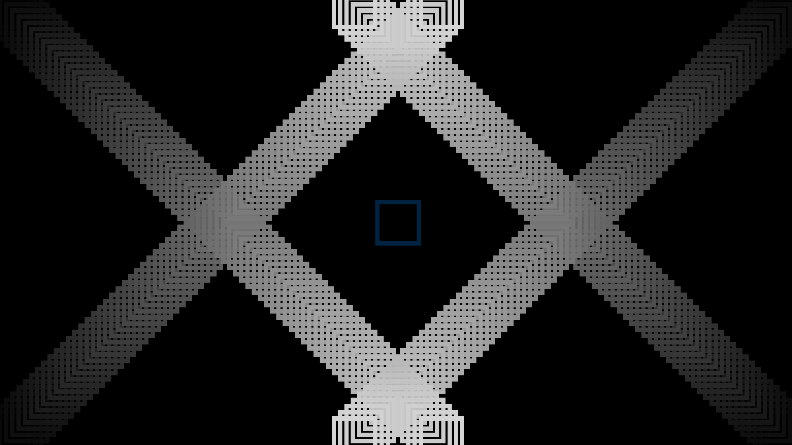

# :chart_with_upwards_trend: SLC
The motivation for this language is to create a simple programmatic interface
for creating diagrams, charts, and graphs.

This program is still a work in progress but it can do pretty cool things.

At the moment on the `develop` branch it has the ability to make this program:
```
height = 1080;
width = 1920;

the_canvas = canvas(height height, width width);

for i in range(72) {
    draw(rectangle(center_x 15 * i, center_y 15 * i, pixel_r 3 * i, pixel_g 3 * i, pixel_b 3 * i)) -> the_canvas;
    draw(rectangle(center_x width - 15 * i, center_y height - 15 * i, pixel_r 3 * i, pixel_g 3 * i, pixel_b 3 * i)) -> the_canvas;
    draw(rectangle(center_x width - 15 * i, center_y 15 * i, pixel_r 3 * i, pixel_g 3 * i, pixel_b 3 * i)) -> the_canvas;
    draw(rectangle(center_x 15 * i, center_y height - 15 * i, pixel_r 3 * i, pixel_g 3 * i, pixel_b 3 * i)) -> the_canvas;
    if i == 70 {
        draw(rectangle(center_x width / 2, center_y height / 2, pixel_g 35, pixel_b 66)) -> the_canvas;
    }
}
draw(the_canvas) -> "out.png";
```

To create this image:



Algorithmically efficiently and without memory leaks.
